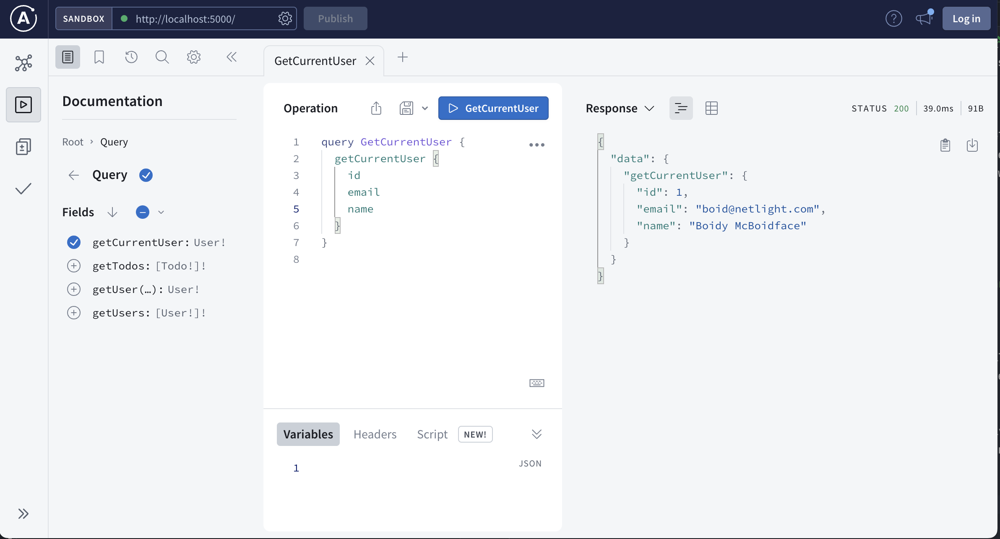

# GraphQL workshop
Hello there fellow boid 👋
Below you should find the relevant information necessary to get up and running with the materials for this workshop.

The project is organized as a monorepo with a backend and a frontend. The backend is based on Node, Apollo Server, Codegen and Prisma (the latter is configured and ready to go). The frontend is based on React, Apollo Client and Codegen.

## Getting started

A prerequisite to getting up and running is that you have Yarn and Node installed on your computer. 

### Backend
Run `yarn install` followed by `yarn dev` in the `backend` folder. This will install all dependencies, create a local SQLite database, seed the database with some data, generate type information for our GraphQL schemas, and launch the backend in watch mode on `http://localhost:5000`.

When you do changes to _.ts_ files in the backend it will automatically reload within a couple of seconds. When you do changes to _.graphql_ files in the backend type information will automatically be generated and the backend will reload.

When the backend is up and running you should be able to open the GraphQL Playground on `http://localhost:5000`.

If you want to get a clean database with seeded data to work with, run `yarn prisma:fresh`.

### Frontend
Run `yarn install` followed by `yarn dev` in the frontend folder. This will install all dependencies, generate type information for our GraphQL queries, and launch the frontend in watch mode on `http://localhost:3000`

When you do changes to _.ts(x)_ files in the frontend it will automatically reload. When you do changes to _.graphql_ files in the frontend type information will automatically be generated.

